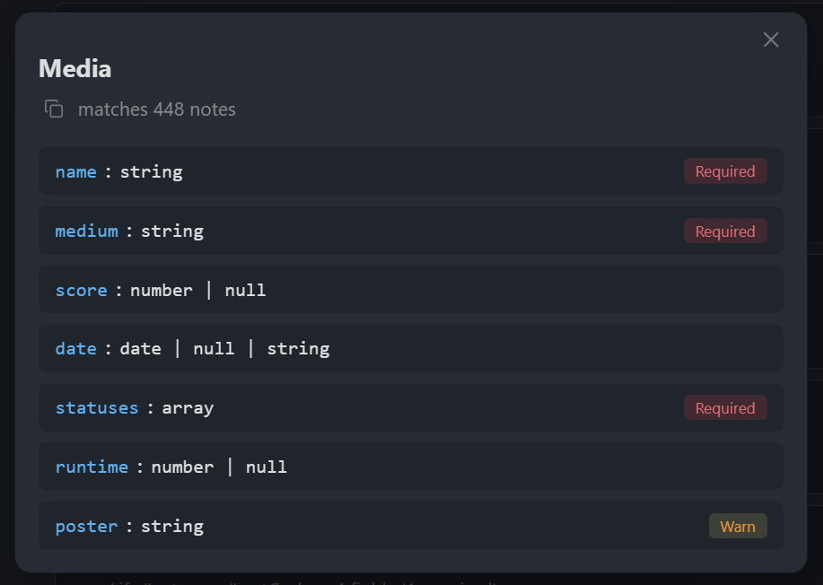
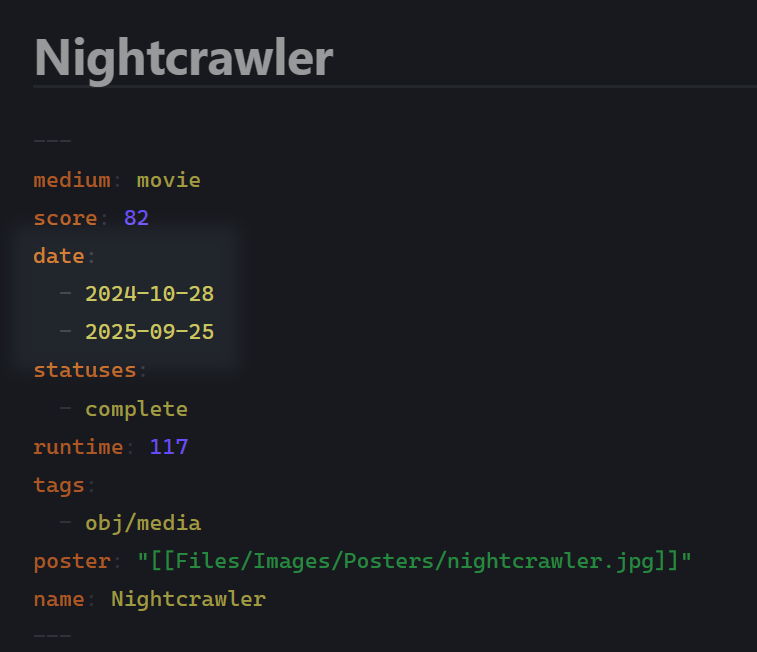
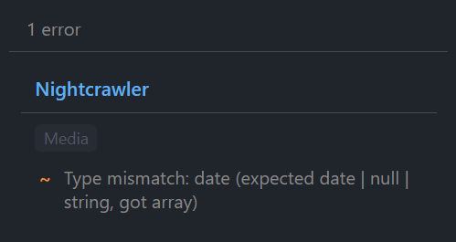

# Propsec

Schema enforcement for Obsidian properties. 

Define schemas based on templates or invariants in your vault, add custom reusable types, and more.

# Usage
First, define a schema:

  

Once saved, violating notes such as this one...

  

...will be caught by the validation:

  

## Why

Obsidian properties are freeform. Over time, things can break: you change the structure, use an old field, etc. This plugin validates notes against schemas you define. Your notes are untouched, but your vault's consistency becomes easier to manage.

## Setup

1. Open plugin settings
2. Create a schema: click **+ Add Schema**
3. Set a query to target notes
4. Add fields: name, type, required/optional
5. Violations appear in the status bar/sidebar

## Schema definition
The query field allows schema matching based on file paths and/or tags:

| Query | Matches |
|-------|---------|
| `Journal` | Notes directly in Journal folder |
| `Journal/*` | Notes in Journal and all subfolders |
| `#book` | Notes with #book tag |
| `Projects/* or #active` | Notes matching either condition |

You can also narrow which notes a schema applies to with properties:

- `File name matches`: Filter by file name (regex)
- `Modified after` / `Modified before`: Filter by modification date
- `Created after` / `Created before`: Filter by creation date
- `Has property` / `Missing property`: Filter by property existence
- `Property conditions`: Filter by property values (property-operator-value list)

## Field types
### Primitives
`string`, `number`, `boolean`, `date`, `array`, `object`, `null`, `unknown`

### Custom types
Define reusable types in settings. A custom type is a named group of fields. Use them when multiple schemas share the same structure or you need nested validation.

### Union types
Add multiple field entries with the same name but different types. For example, two entries for `status` with types `string` and `null` creates `string | null`.

## Field flags
Fields can be flagged to be **required** (key is required) xor **warn** (soft requirement). There is also a **unique** constraint that prevents duplicate values on that field.

Finally, there are **cross-field constraints** (compare this field's value to another field) and **conditional validation** (only validate this field when another field matches a condition).

## Constraints

Each field type supports optional constraints:

| Type | Constraints |
|------|-------------|
| string | `pattern` (regex), `minLength`, `maxLength` |
| number | `min`, `max` |
| array | `minItems`, `maxItems`, `contains` (required values) |
| date  | `min`, `max` |

## Installation

Copy to `.obsidian/plugins/` or install via BRAT.
